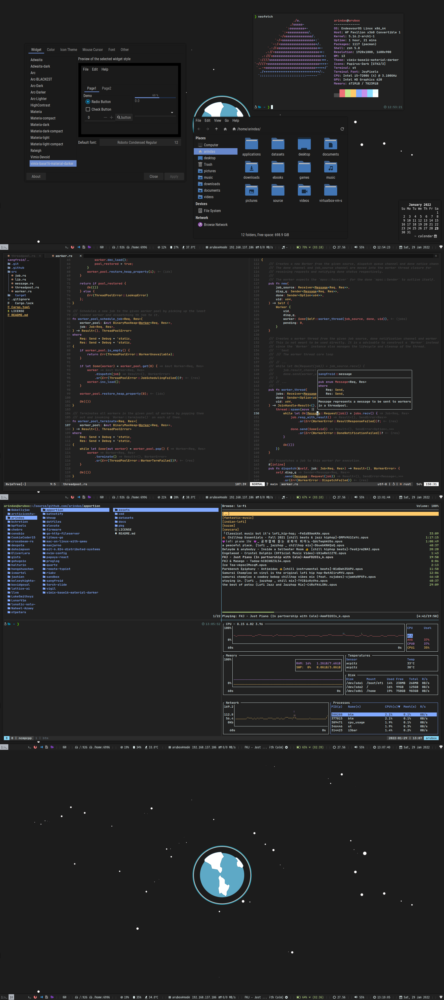

# dotfiles

`~/.config` files to reproduce the following desktop:

### Package specific configs
- st: https://github.com/siduck/st
- nvim-config: https://github.com/arindas/nvim-config
- gtk-theme: https://github.com/arindas/vimix-base16-material-darker
